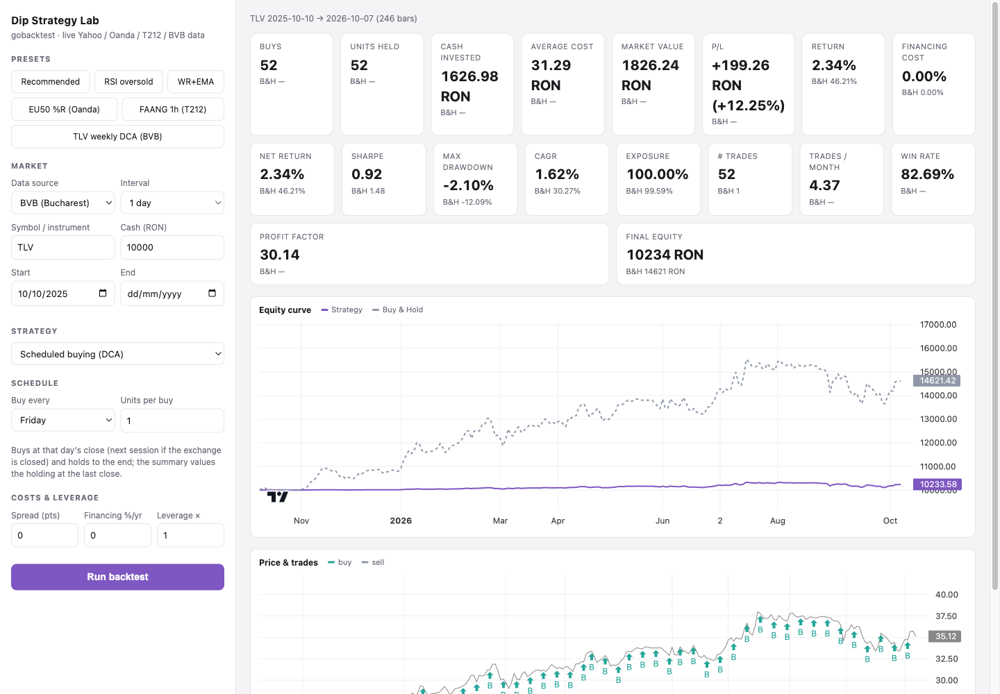

# gobacktest-ui

An interactive, multi-source backtesting web lab built on
[`gobacktest`](https://github.com/florinel-chis/gobacktest). Pick a data
source (Yahoo Finance, Oanda, Trading 212 or the Bucharest Stock Exchange), a
symbol/instrument, a bar interval, and a date range; build a strategy from a
condition builder (AND/OR indicator conditions with take-profit / stop-loss /
time exit, single-shot or pyramiding), a ready-made library strategy
(Williams %R oversold, with or without an EMA filter), or a **scheduled
buying (DCA)** plan; run it against live data; and see the equity curve vs.
buy & hold, the price chart with trade markers, and a full stats scorecard,
right in the browser.



The whole app is a single Go binary: the server is stdlib `net/http` only,
and the frontend (`index.html`, Lightweight Charts) is embedded and served
locally — no external JS CDN, no separate frontend build.

## Run

With `OANDA_TOKEN` exported to a personal access token (optional — only
needed for the Oanda source):

```
go run . -addr :8080
```

Then open http://localhost:8080.

`OANDA_TOKEN` can also be supplied via a single-line `.env` file in the
working directory instead of the process environment; the process
environment always takes priority when both are present. The token is read
on the server only and is never sent to the browser. If it isn't set, the
Yahoo source still works; selecting Oanda without a token returns a clear
error instead of a stack trace.

By default the server listens on `127.0.0.1:8080` (loopback only — there is
no authentication, so it should not be exposed on all interfaces without
your own access control in front of it). Pass `-addr :8080` (or any other
address) to change that.

## Docker

A multi-stage [Dockerfile](Dockerfile) builds the app into a minimal
distroless image (single static binary, frontend embedded, CA certificates
included for the live data calls):

```
docker build -t gobacktest-ui .
docker run --rm -p 127.0.0.1:8080:8080 gobacktest-ui
```

Then open http://localhost:8080. To enable the Oanda source, pass the token
as an environment variable:

```
docker run --rm -p 127.0.0.1:8080:8080 -e OANDA_TOKEN=your-token gobacktest-ui
```

Inside the container the server binds all interfaces (`-addr :8080`), so the
`-p` port mapping is the access control: keep the `127.0.0.1:` prefix unless
you have your own authentication or firewall in front of it. Extra flags can
be appended after the image name, e.g.
`docker run --rm -p 9000:9000 gobacktest-ui -addr :9000`.

## Features

- **Data sources**, all behind the same `source.Source` interface:
  - **Yahoo Finance**: no credentials.
  - **Oanda**: requires `OANDA_TOKEN`.
  - **Trading 212**: requires `T212_API_KEY` / `T212_API_SECRET`. T212 has no candle
    endpoint, so tickers resolve to Yahoo bars.
  - **BVB (Bucharest Stock Exchange)**: no credentials. Native, split-adjusted RON
    bars from BVB's own public datafeed via
    [`bvb-go`](https://github.com/florinel-chis/bvb-go), which sends browser-like
    requests and retries BVB's transient throttling on its own.
- **Intervals**: from 1-minute bars up to daily/weekly/monthly, subject to
  each source's own supported set.
- **Strategy building**:
  - A condition builder — combine indicator conditions (RSI, Williams %R,
    Williams %R + EMA, CCI, Stochastic %K, ROC, ADX, Bollinger %B, distance
    from SMA) with AND/OR logic, a required take-profit, an optional
    stop-loss and time-based exit, and either single-position or
    pyramiding (multi-lot, cooldown-gated) entries.
  - Library strategies from `gobacktest/strategies` — Williams %R oversold
    mean reversion, with or without an EMA trend filter.
  - **Scheduled buying (DCA)**: buy a whole number of units every chosen
    weekday at that day's close and hold to the end — "what would I have if I
    had bought 1 share every Friday?". A day the exchange is closed buys on the
    next session, without looking ahead. The summary leads with buys, units
    held, cash invested, average cost, market value at the last close, and
    P/L. Dividends and other corporate actions are not modelled; BVB prices
    are split-adjusted, so a unit is one of today's shares.
- **Costs & leverage**: configurable spread (in price points), annual
  financing rate, and leverage (margin), applied identically to the
  strategy run and its buy & hold benchmark. For the Oanda source, the
  "Costs & leverage" panel can prefill live spread, financing rate, and
  margin rate for the selected instrument straight from Oanda's instrument
  facts endpoint.
- **Currency**: the engine is currency-agnostic. Cash, equity and P/L are in
  the currency the prices are quoted in, and the app labels them that way:
  BVB runs read e.g. `10234 RON`, and an Oanda instrument uses its quote
  currency (`EU50_EUR` → EUR). The Cash field shows the currency it expects.
  Yahoo and Trading 212 listings vary in currency and the client doesn't
  report it, so their amounts are shown without a symbol rather than with a
  guessed `$`.
- **Presets**, one click each: including **TLV weekly DCA (BVB)**.
- **Results**: an equity curve chart (strategy vs. buy & hold), a price
  chart with buy/sell trade markers, and a stats table (return, financing
  cost, net return, Sharpe, max drawdown, CAGR, exposure, trade count and
  frequency, win rate, profit factor, final equity) for both the strategy
  and the buy & hold benchmark.

## License

MIT — see [LICENSE](LICENSE).
